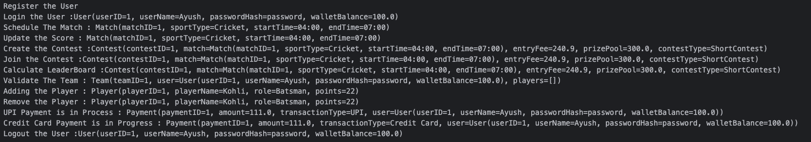

# FAANG LLD - MPL Low-Level Design

## Overview
This repository contains the low-level design (LLD) of a fantasy sports application modeled after MPL. The system is designed to handle user registration, match scheduling, contest creation, team management, and payment processing.

## Model Structure

### Contest
Represents a fantasy contest where users can participate.
```plaintext
- int contestID
- Match match
- double entryFee
- double prizePool
- String contestType
```

### Match
Represents a real-world sports match.
```plaintext
- int matchID
- String sportType
- String startTime
- String endTime
```

### Payment
Handles financial transactions within the system.
```plaintext
- int paymentID
- double amount
- String transactionType
- User user
```

### Player
Represents an individual player participating in a match.
```plaintext
- int playerID
- String playerName
- String role
- String points
```

### Team
Represents a user's fantasy team.
```plaintext
- int teamID
- User user
- List<String> players
```

### User
Represents a user in the system.
```plaintext
- int userID
- String userName
- String passwordHash
- double walletBalance
```

## Service Structure

### Contest Service
Handles contest-related operations.
```plaintext
- createContest(Contest contest)
- joinContest(Contest contest)
- calculateLeaderBoard(Contest contest)
```

### Match Service
Handles match-related operations.
```plaintext
- scheduleMatch(Match match)
- updateScore(Match match)
```

### Payment Service
Handles payment processing.
```plaintext
- processPayment(Payment payment)
```

### Player Service
Handles player-related operations.
```plaintext
- getPoints(Player player)
```

### Team Service
Handles team management.
```plaintext
- addPlayer(Team team, Player player)
- removePlayer(Team team, Player player)
- validateTeam(Team team)
```

### User Service
Handles user-related operations.
```plaintext
- register()
- login(User user)
- logout(User user)
- addFunds(User user, Payment payment)
- withdrawFunds(User user, Payment payment)
```

